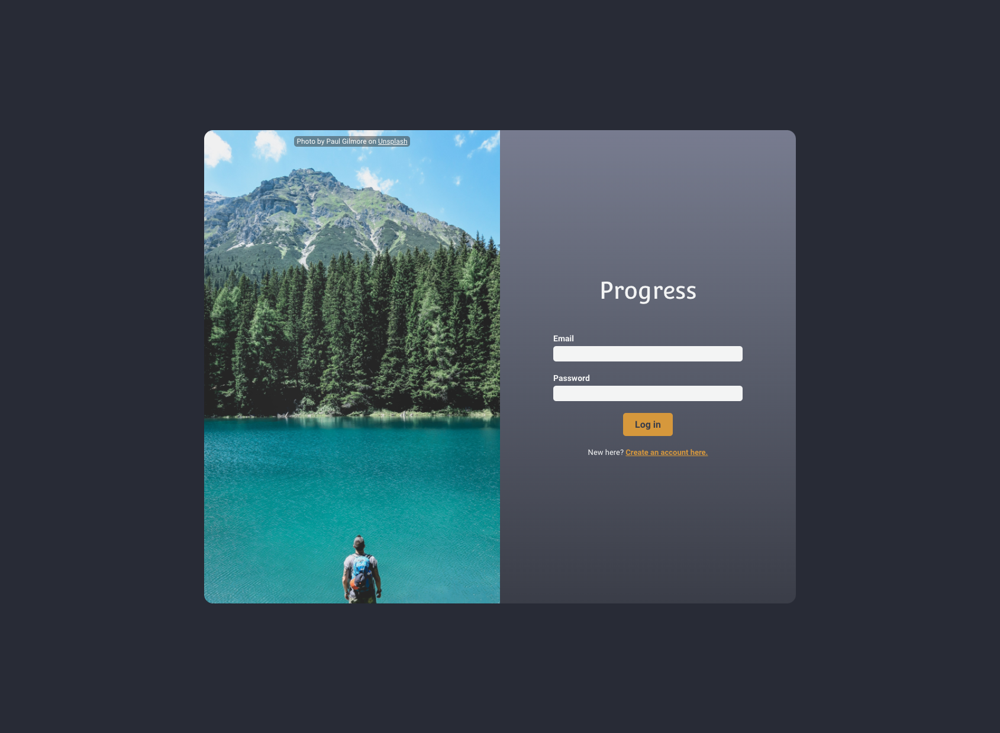
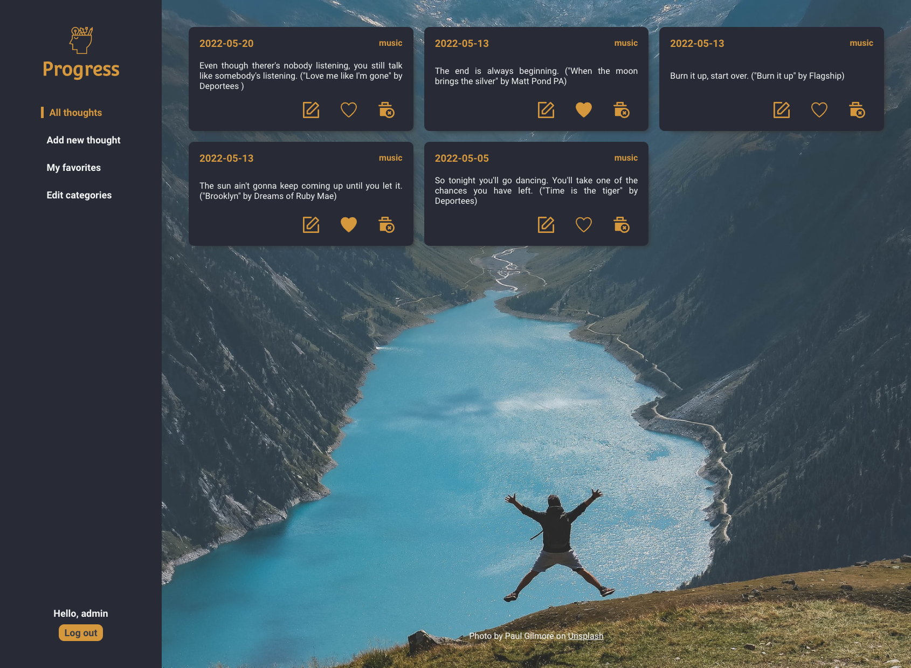
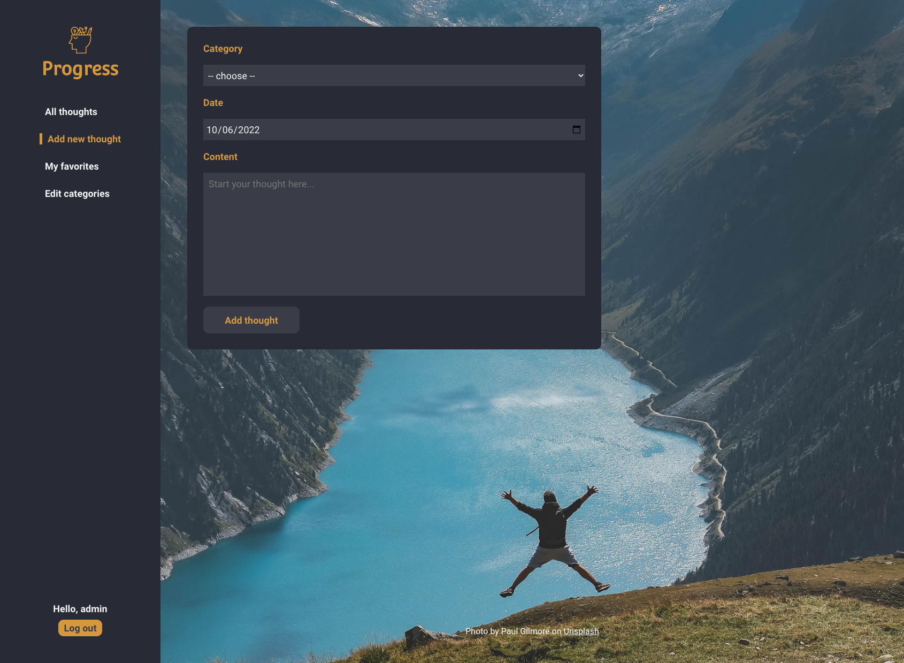
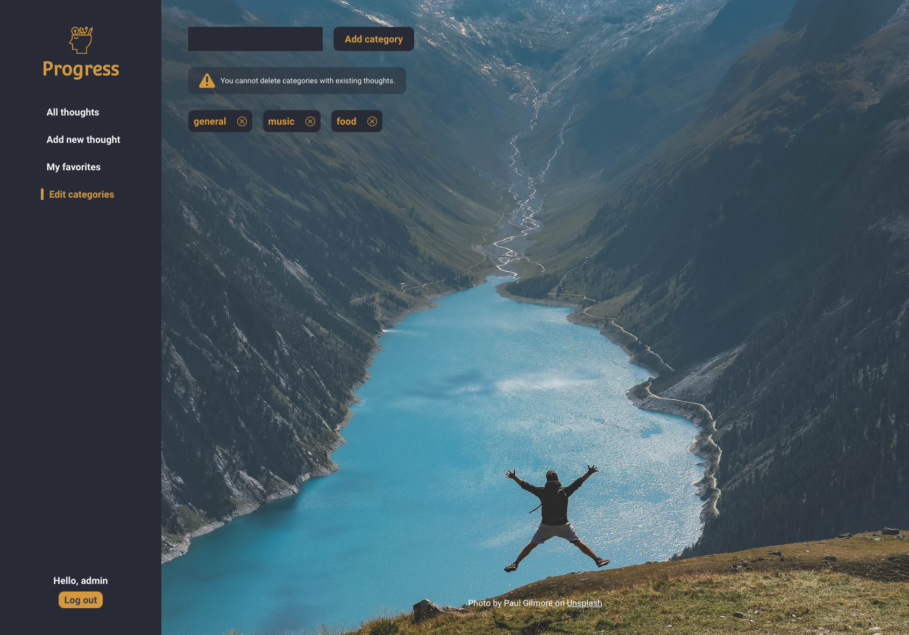

# Progress App

This project is a CRUD application that allows an user to login and add thoughts of various categories.

Technologies used

- MongoDB
- Express.js
- React.js
- Node.js

Screenshots

Credits

- Icons
  - [SVG Repo](https://www.svgrepo.com/)
- Photos
  - [Paul Pastourmatzis](https://unsplash.com/photos/8kDOOrs608I)
  - [Paul Pastourmatzis](https://unsplash.com/photos/EXbGG5dBZKw)
